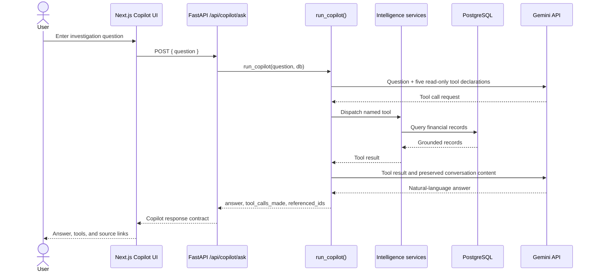

# AI Copilot Architecture

## Current implementation

The Copilot is a backend-only Gemini agent in `backend/app/core/agent.py`. The frontend sends a question to `POST /api/copilot/ask`; it never sends the Gemini key or calls the provider directly.



## Available tools

The agent exposes exactly five read-only tools:

1. `query_transactions`
2. `get_exceptions`
3. `get_settlement_status`
4. `compare_periods`
5. `trace_transaction_chain`

Each dispatches to an existing function in `backend/app/core/intelligence.py`. The agent recursively extracts identifiers from tool results for the `referenced_ids` response field.

## Grounding model

The deterministic backend remains authoritative:

- tool queries use the same service functions used by REST endpoints
- the agent is instructed to call a tool before quoting financial figures or records
- the agent does not perform writes
- the frontend renders the answer and returned metadata, rather than calculating new financial values

## Configuration and current status

The configured model is `gemini-3.6-flash`. The backend dependency is `google-genai>=1.75,<2.0`, selected because current Gemini function-call responses include thought-signature metadata that older SDK versions cannot represent.

**AI Copilot is an investigation layer currently under validation.** The code and mocked tests pass, but the latest live provider request reached Gemini and returned `503 UNAVAILABLE` because the model was experiencing high demand. This is an external provider availability limitation; the application does not fabricate an answer when the provider fails.

Required local variable:

```text
GEMINI_API_KEY=
```

The value is loaded server-side through `app.core.config.Settings` and is never exposed to the browser.
