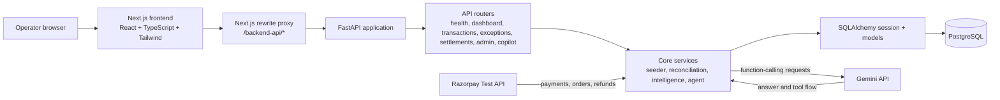
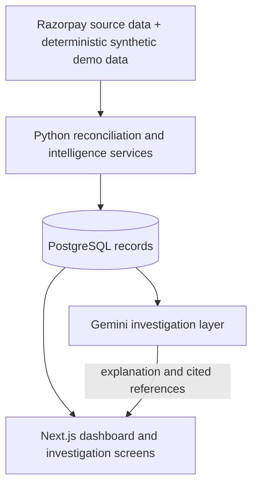

# System Architecture

## Overview

The application is a local, single-tenant MVP. The browser uses the Next.js application and its rewrite proxy; FastAPI owns financial calculations, database access, reconciliation, and the Gemini integration.

## Runtime boundaries

- The frontend calls relative `/backend-api` paths by default. `frontend/next.config.ts` rewrites them to the local backend at `127.0.0.1:8009`.
- FastAPI routes delegate to core service functions rather than implementing separate financial calculations in the UI.
- SQLAlchemy uses the `DATABASE_URL` loaded by `app.core.config.Settings`.
- The seeder calls Razorpay Test API for available source data and creates synthetic records for the deterministic demo cohort.
- The Copilot runs only in the backend. `GEMINI_API_KEY` is never sent to the browser.

## Source-of-truth boundary

The deterministic services and database records are the financial source of truth. Gemini explains and investigates; it does not own calculations or writes.
