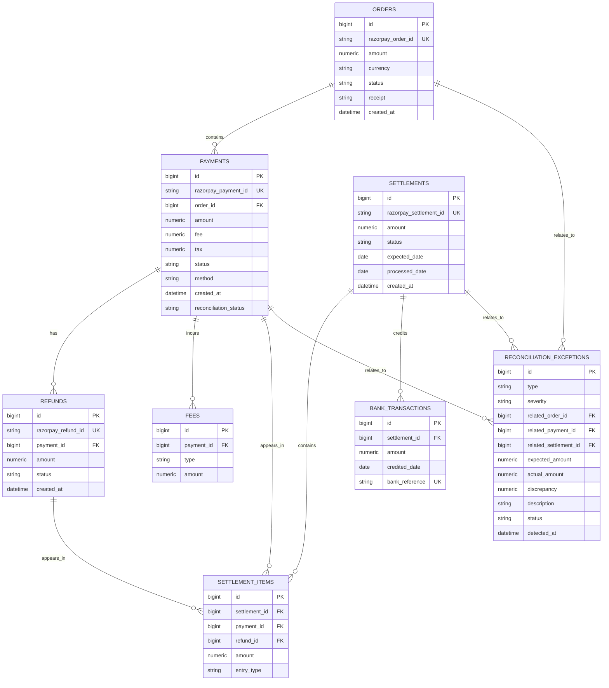

# Database ER Diagram

The diagram below follows the SQLAlchemy entities and foreign keys in `backend/app/models/entities.py`. `settlement_items` can reference either a payment or a refund according to its `entry_type`; fee deductions reference a payment.

## Relationship notes

- Every payment requires an order through `payments.order_id`.
- Refunds and fees belong to payments.
- Settlement items belong to settlements and may reference a payment or refund.
- Bank transactions optionally belong to settlements; the foreign key uses `SET NULL` on settlement deletion.
- Exception references are nullable and use `SET NULL` on deletion.
- Entity-level uniqueness constraints cover Razorpay order/payment/refund/settlement identifiers, fee type per payment, and bank references.
