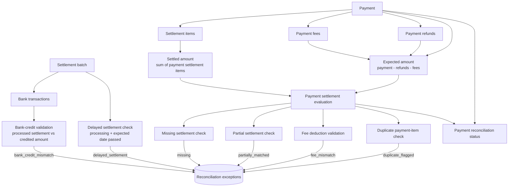

# Reconciliation Architecture

## Flow

The reconciliation engine in `backend/app/core/reconciliation.py` recalculates payment reconciliation statuses and creates derived exception rows. It processes payment-level settlement items first, then evaluates settlement-level delay and bank-credit conditions.

## Implemented detection cases

| Case | Implemented condition | Derived result |
|---|---|---|
| Missing settlement | Payment has no settlement items and its expected date has passed | `missing` status and `missing_settlement` exception |
| Partial settlement | Signed settlement-item total is below expected amount and payment is not duplicated | `partially_matched` status and `partial_settlement` exception |
| Duplicate | At least two payment settlement items reference the payment | `duplicate_flagged` status and `duplicate` exception |
| Fee mismatch | Absolute fee deductions differ from payment fee rows | `fee_mismatch` status and `fee_mismatch` exception |
| Delayed settlement | Settlement is `processing` and its expected date has passed | `delayed_settlement` exception |
| Bank-credit mismatch | Processed settlement's credited bank amount differs from settlement amount | `bank_credit_mismatch` exception; eligible settled payments are marked `bank_mismatch` |

The engine deletes existing exception rows and resets payment statuses before recalculating. This makes repeated reconciliation deterministic, but it does not preserve manually changed exception statuses.

## Demo data creation

`backend/app/core/seeder.py` creates conditions; it does not detect anomalies. It ingests Razorpay payments when available, creates the deterministic fallback cohort when necessary, adds settlement items/fees/bank transactions, and commits the source records. Reconciliation remains the component that derives statuses and exception rows.
